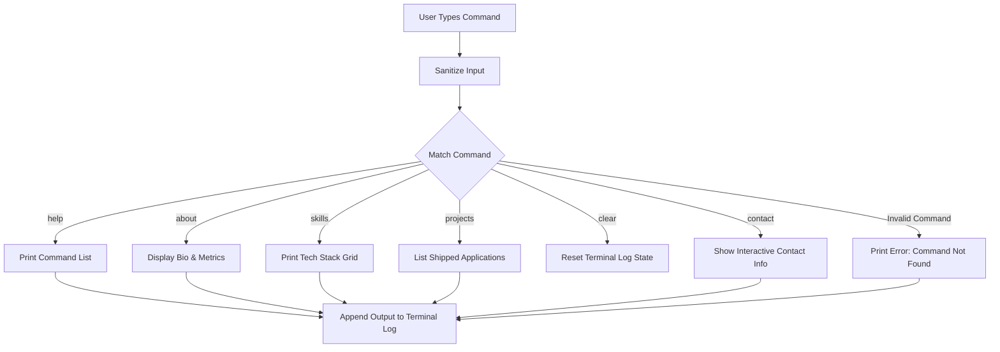
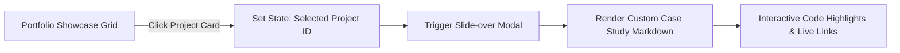

# 💻 MukulMBR Portfolio & Developer Hub

[](LICENSE)
[](https://react.dev)
[](https://tailwindcss.com)
[](https://vite.dev)

A premium, interactive developer portfolio, command-line hub, and engineering showcase portal representing my journey, technical depth, and shipped products.

---

## 📖 Table of Contents
1. [✨ Key Features](#-key-features)
2. [📐 System Architecture](#-system-architecture)
3. [⌨️ Terminal CLI Commands](#%EF%B8%8F-terminal-cli-commands)
4. [🚀 Tech Stack](#-tech-stack)
5. [📂 Folder Structure](#-folder-structure)
6. [⚙️ Local Installation](#%EF%B8%8F-local-installation)
7. [💻 Running the App](#-running-the-app)
8. [🧠 Implementation Highlights](#-implementation-highlights)
9. [👤 Author](#-author)

---

## ✨ Key Features

### 1. ⌨️ Interactive Retro Terminal CLI
* **Custom Command Parser:** A fully functional React-based terminal emulator allowing users to query information about my skills, background, and projects in real-time.
* **Command History & Autocomplete:** Simulates a real terminal experience with command log rendering, a blinking cursor, and input focus handlers.

### 2. 📁 Product-Focused Case Studies
* **Slide-Over Detail Panels:** Interactive overlay panels that break down projects like a Staff Engineer.
* **Structured Walkthroughs:** Each case study includes **Problem Statement**, **System Architecture**, **Technical Challenges**, **Solutions**, and **Business/Performance Impact**.

### 3. 🎨 Premium Glassmorphic UI
* **Luxury Design Language:** Tailored dark-mode backgrounds (`#0B0D0F`), glowing radial gradient halos, and brushed gold border accents.
* **Micro-Animations:** Magnetic buttons, hover-responsive scale grids, and smooth custom transitions.

### 4. ⚙️ Persistent Theme State
* **Style Synchronization:** Smooth dark/light mode transition state synced instantly to `localStorage` and `document.documentElement` styles.

---

## 📐 System Architecture

### 1. CLI Input Parser Flow


### 2. Case Study View Routing


---

## ⌨️ Terminal CLI Commands

Type these commands directly into the terminal simulator on the homepage:

| Command | Description |
| :--- | :--- |
| `help` | Lists all available interactive commands. |
| `about` | Displays professional summary, location, and key developer metrics. |
| `skills` | Renders a categorized grid of languages, frameworks, and databases. |
| `projects` | Lists featured engineering projects with direct index IDs. |
| `project <id>` | Opens the detailed case study panel for a specific project (e.g. `project 1`). |
| `contact` | Displays social links (GitHub, LinkedIn, Email) with terminal formatting. |
| `clear` | Clears the terminal screen buffer. |

---

## 🚀 Tech Stack

* **Core Framework:** React 19 (TypeScript)
* **Styling:** Tailwind CSS v4 (Custom @theme variables, fluid utility classes)
* **Icons:** Lucide React / Brand SVG Assets
* **Build Tool:** Vite v6

---

## 📂 Folder Structure

```text
mukulmbr-hub/
├── public/                 # Favicon, robots.txt, and static assets
├── src/
│   ├── assets/             # Brand logos and images
│   ├── App.tsx             # Central UI layout, terminal state, and case study data
│   ├── index.css           # Global stylesheets & custom keyframe animations
│   └── main.tsx            # React bootstrap script
├── package.json
└── vite.config.ts
```

---

## ⚙️ Local Installation

### Prerequisites
* **Node.js** (v18 or higher)
* **npm** or **bun**

### Steps
1. Clone the repository:
   ```bash
   git clone https://github.com/MukulMBR/mukulmbr-hub.git
   ```
2. Navigate to the project directory:
   ```bash
   cd mukulmbr-hub
   ```
3. Install the dependencies:
   ```bash
   npm install
   ```

---

## 💻 Running the App

### Development Server
Start the local development server:
```bash
npm run dev
```
The application will be accessible at: `http://localhost:5173/`

### Production Build
Compile the application:
```bash
npm run build
```
Preview the production build locally:
```bash
npm run preview
```

---

## 🧠 Implementation Highlights

* **Decoupled DOM Side-Effects:** Viewport adjustments and terminal scrolling are managed using React `useRef` and `scrollIntoView({ behavior: 'smooth' })` to keep the terminal prompt visible on every command output.
* **Tailwind CSS v4 Integration:** Eliminates local configuration files (`tailwind.config.js`) in favor of direct CSS `@theme` directives, resulting in faster compilation times.
* **High Performance Metrics:** Tailored for fast load speeds, utilizing lightweight inline SVGs, asynchronous layouts, and clean DOM structures.

---

## 👤 Author

* **Mukul Bushi Reddy M** - *Product Engineer* - [@MukulMBR](https://github.com/MukulMBR)

---

## 📄 License

This project is licensed under the MIT License.
